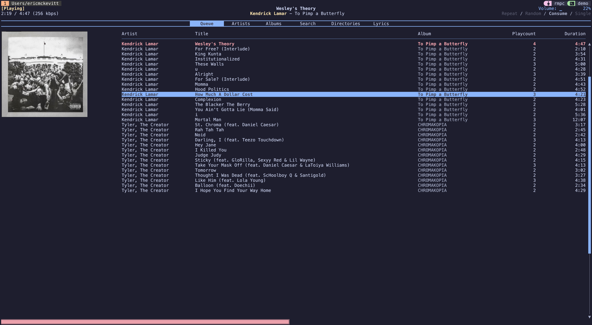
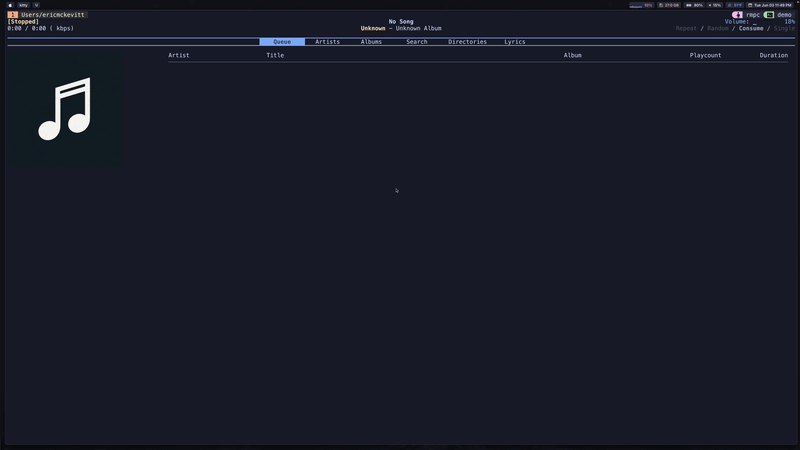
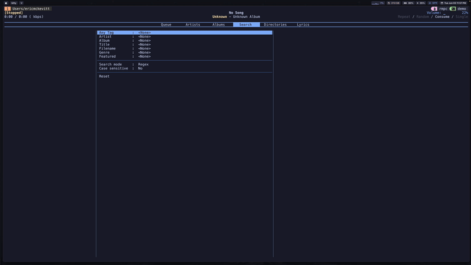

# RMPC Configuration

## 🧠 Overview
This is my personal configuration for rmpc, a command-line client for MPD (Music Player Daemon). It includes custom scripts and MPD settings optimized for a local music library.

<div align="center">
  <br>
  <em>A snapshot of the rmpc interface showing the currently playing track.</em>
</div>

## 📂 Directory Structure
```
.
├── config.ron                  # Main rmpc configuration
├── increment_play_count        # Script to track song plays
├── notify                      # Script to send track notifications on song change
├── README.md
└── themes/
    └── catppuccin_mocha.ron    # Theme file (RON format)
```

## Setup
1.	Dependencies
    - rmpc (https://mierak.github.io/rmpc/next/overview/)
    - mpd (https://mpd.readthedocs.io/en/latest/mpd.conf.5.html)
    - any terminal notifier if you use the notify script
2.	Install
    - Copy config.ron to your config dir (e.g., ~/.config/rmpc/config.ron)
    - Copy over theme or create your own
    - Make scripts executable by running `chmod +x increment_play_count notify`

## 🎬 Demo

<div align="center">
  <table>
    <tr>
      <td></td>
      <td></td>
    </tr>
    <tr>
      <td align="center"><em>Adding to Queue</em></td>
      <td align="center"><em>Search Demo</em></td>
    </tr>
  </table>
</div>
